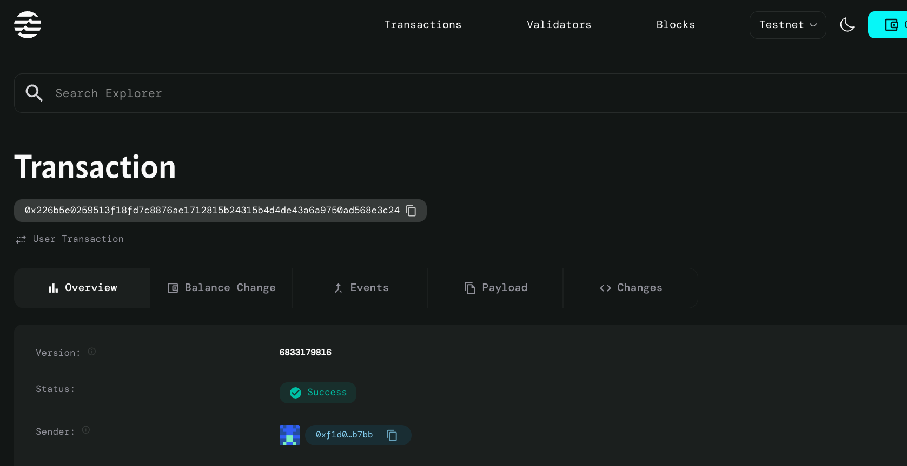

# NFT Evolution Contract

## Project Title
**NFT Evolution Contract** - Dynamic NFTs that Grow with Time and Interaction

## Project Description
The NFT Evolution Contract is an innovative smart contract built on the Aptos blockchain that creates dynamic, evolving Non-Fungible Tokens (NFTs). Unlike traditional static NFTs, these tokens change and evolve based on two key factors: the passage of time since creation and user interactions with the NFT. This creates a living, breathing digital asset that grows alongside its owner's engagement.

Each NFT starts at evolution level 0 and progressively evolves as days pass and as the owner interacts with it. The evolution mechanism rewards both patience and active engagement, creating a unique gamified experience for NFT holders.

## Project Vision
Our vision is to revolutionize the NFT space by creating dynamic digital assets that provide ongoing value and engagement to their owners. We aim to move beyond static JPEGs to create NFTs that tell a story, grow with their community, and provide continuous utility through their evolutionary mechanics.

We envision a future where NFTs are not just collectibles, but living digital companions that respond to their owner's dedication and the passage of time, creating deeper emotional connections between collectors and their digital assets.

## Key Features

**🕒 Time-Based Evolution**
- NFTs automatically evolve based on the number of days since their creation
- Long-term holding is rewarded with higher evolution levels

**🤝 Interaction-Driven Growth**
- Users can actively interact with their NFTs to accelerate evolution
- Every 5 interactions contribute to the next evolution level

**📈 Progressive Leveling System**
- NFTs start at level 0 and can theoretically evolve indefinitely
- Evolution level increases based on combined time and interaction factors

**🎮 Gamified Experience**
- Encourages regular engagement with the NFT
- Creates anticipation and excitement around NFT development

**⚡ Efficient Design**
- Lightweight smart contract optimized for the Aptos blockchain
- Gas-efficient operations for minting and interactions

**🔒 Ownership Protection**
- Each address can only own one evolving NFT at a time
- Secure ownership verification and interaction tracking

## Future Scope

**🎨 Visual Evolution**
- Integration with metadata servers to change NFT appearance based on evolution level
- Dynamic artwork that reflects the NFT's growth journey

**🏆 Achievement System**
- Special milestones and achievements for reaching certain evolution levels
- Rare evolution paths based on specific interaction patterns

**🌐 Cross-NFT Interactions**
- Ability for NFTs to interact with each other
- Breeding or collaboration mechanics between evolved NFTs

**💰 Economic Utilities**
- Staking rewards based on evolution level
- Marketplace premium for highly evolved NFTs

**📱 Mobile Application**
- Dedicated app for easy NFT interaction and evolution tracking
- Push notifications for evolution milestones

**🎯 Specialized Evolution Paths**
- Different evolution tracks based on interaction types
- Skill trees and specialization for NFTs
mar
**🔗 Interoperability**
- Cross-chain evolution mechanics
- Integration with other blockchain ecosystems

## Contract Details
0x226b5e0259513f18fd7c8876ae1712815b24315b4d4de43a6a9750ad568e3c24
